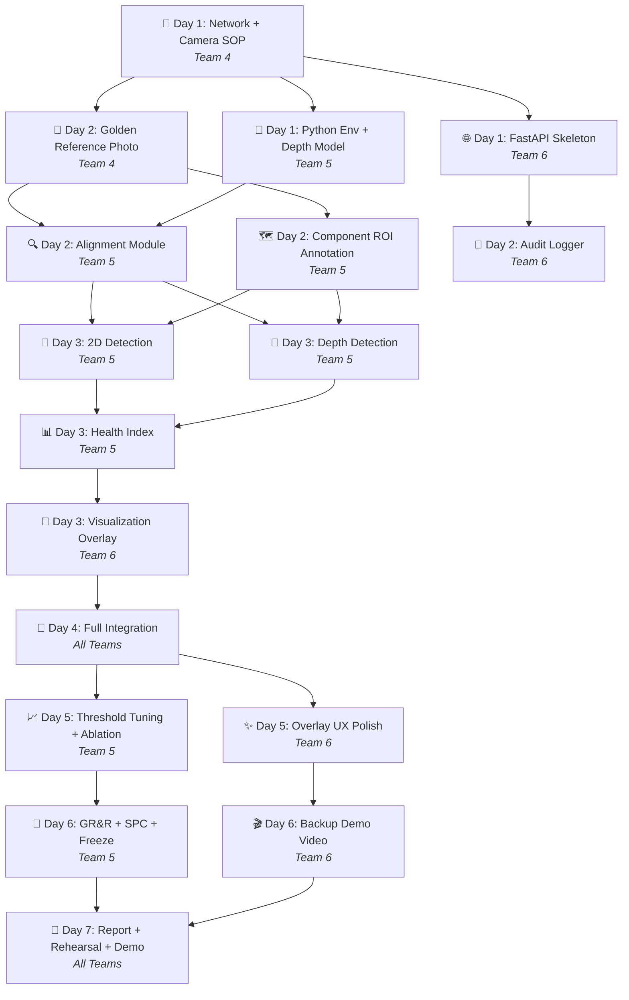

# PCB / Motherboard AI Inspection System
## 📋 Step-by-Step Procedure — Project Start to Finish

> **1-Week Sprint** | This document defines the exact order of tasks so every team member knows **what to do, when, and in what order.**

---

## How to Use This Document

- ✅ Check off tasks as you complete them
- 🚫 **Do NOT skip exit gates** — the next phase depends on the current one passing
- 🔗 Tasks marked with a team name are **owned by that team** but may need collaboration
- ⏱️ Time estimates are approximate — adjust based on pace

---

## Phase 0 — Pre-Sprint Setup (Before Day 1)

> Get the repo and understand the project before the sprint starts.

| # | Task | Owner | Status |
|---|---|---|---|
| 0.1 | Clone the repository: `git clone https://github.com/Monishp-eng/IMAGE-PROCESSING.git` | All | ☐ |
| 0.2 | Read `docs/project_study_guide.md` — understand the full project in simple terms | All | ☐ |
| 0.3 | Read your team-specific doc (`team4_data_engineering.md` / `team5_model_optimization.md` / `team6_ai_deployment.md`) | All | ☐ |
| 0.4 | Read `docs/implementation_plan.md` — understand the architecture, modules, and evaluation | All | ☐ |
| 0.5 | Ensure both laptops are available and functioning (Laptop A = camera, Laptop B = server) | Team 4 + 6 | ☐ |
| 0.6 | Ensure the Ubiquiti router is available and powered on | Team 4 | ☐ |
| 0.7 | Source the PCB / motherboard board to inspect (or a high-res printout for initial dev) | Team 4 | ☐ |

---

## Phase 1 — Day 1: Environment, Network & Skeleton

> **Goal:** Everything is connected and a dummy pipeline runs end-to-end.

### Step 1.1 — Network Setup *(Team 4)*

| # | Task | Details | Status |
|---|---|---|---|
| 1.1.1 | Configure Ubiquiti router | Assign a **static IP** to Laptop B (e.g., `192.168.1.100`) | ☐ |
| 1.1.2 | Connect both laptops to the Ubiquiti network | Verify both are on the same subnet | ☐ |
| 1.1.3 | Test connectivity | `ping LAPTOP_B_IP` from Laptop A — confirm response | ☐ |
| 1.1.4 | Document the IP | Write Laptop B's IP in `docs/api_contract.md` and share with Teams 5 & 6 | ☐ |

### Step 1.2 — Camera & Physical Setup *(Team 4)*

| # | Task | Details | Status |
|---|---|---|---|
| 1.2.1 | Position Laptop A's webcam above the board | Fix distance, angle, and board orientation | ☐ |
| 1.2.2 | Tape the laptop corners to the table | All four corners — prevent movement | ☐ |
| 1.2.3 | Tape the PCB placement zone on the table | Mark exact position and orientation the board should be placed | ☐ |
| 1.2.4 | Lock camera exposure | Disable auto-brightness — set manual exposure if possible | ☐ |
| 1.2.5 | Photograph a white-balance reference card | Under the same lighting conditions | ☐ |
| 1.2.6 | Write `docs/camera_setup_sop.md` | Record: lens-to-board distance (cm), light source, exposure setting, date/time | ☐ |

### Step 1.3 — Python Environment *(Team 5)*

| # | Task | Details | Status |
|---|---|---|---|
| 1.3.1 | Create virtual environment on Laptop B | `python -m venv venv` → `venv\Scripts\activate` | ☐ |
| 1.3.2 | Install all dependencies | `pip install fastapi uvicorn[standard] python-multipart opencv-python opencv-contrib-python torch torchvision transformers pillow numpy scipy pandas scikit-image scikit-learn ultralytics pytest pytest-cov` | ☐ |
| 1.3.3 | Save to requirements file | `pip freeze > server/requirements.txt` | ☐ |
| 1.3.4 | Pre-download Depth Anything V2 model | `python -c "from transformers import pipeline; pipeline(task='depth-estimation', model='depth-anything/Depth-Anything-V2-Small-hf')"` | ☐ |
| 1.3.5 | Test depth model on any sample photo | Confirm it runs and produces a depth map (shape + value range) | ☐ |
| 1.3.6 | Record inference time on Laptop B's CPU | Expected: 1–4 seconds per image for ViT-S | ☐ |

### Step 1.4 — FastAPI Server Skeleton *(Team 6, with Team 5)*

| # | Task | Details | Status |
|---|---|---|---|
| 1.4.1 | Scaffold `server/main.py` | Create FastAPI app with dummy endpoints: `POST /inspect`, `POST /set-reference`, `GET /health` | ☐ |
| 1.4.2 | Start server | `python -m uvicorn server.main:app --host 0.0.0.0 --port 8000` | ☐ |
| 1.4.3 | Test dummy `/inspect` locally | `curl -F "image=@test.jpg" http://localhost:8000/inspect` → should return dummy JSON | ☐ |

### Step 1.5 — Client Script *(Team 6)*

| # | Task | Details | Status |
|---|---|---|---|
| 1.5.1 | Create `client/capture_and_send.py` | Webcam preview → SPACE to capture → POST to Laptop B → display result | ☐ |
| 1.5.2 | Create `client/requirements.txt` | `opencv-python`, `requests`, `numpy` | ☐ |
| 1.5.3 | Install client dependencies on Laptop A | `pip install -r client/requirements.txt` | ☐ |
| 1.5.4 | Update `SERVER_URL` in the script | Use Laptop B's static IP from Step 1.1.4 | ☐ |

### 🚪 Day 1 Exit Gate

> **All of the following must pass before moving to Day 2:**

- [ ] `curl -F "image=@test.jpg" http://LAPTOP_B_IP:8000/inspect` returns HTTP 200 with dummy JSON
- [ ] `capture_and_send.py` on Laptop A sends a frame and prints `Health Index: 0.990 | Verdict: PASS`
- [ ] Ubiquiti link confirmed stable for 15+ minutes
- [ ] Depth Anything V2 model loads and produces a depth map
- [ ] Camera position documented in `docs/camera_setup_sop.md`

---

## Phase 2 — Day 2: Golden Reference, Data Collection & Alignment

> **Goal:** The golden reference board is captured, depth reference is computed, alignment works, and audit logging is in place.

### Step 2.1 — Capture Golden Reference *(Team 4)*

| # | Task | Details | Status |
|---|---|---|---|
| 2.1.1 | Place the perfect (all-parts-present) board at the marked position | Follow the Day 1 SOP exactly | ☐ |
| 2.1.2 | Take 5 photos of the same golden board | Use **lossless PNG** — no JPEG compression | ☐ |
| 2.1.3 | Team 5 picks the sharpest photo | Save as `server/reference/golden_board.png` | ☐ |
| 2.1.4 | Document the shot | Record date, time, lighting conditions in `docs/camera_setup_sop.md` | ☐ |

### Step 2.2 — Initial Test Board Photography *(Team 4)*

| # | Task | Details | Status |
|---|---|---|---|
| 2.2.1 | Photograph 10 initial test boards | Mix of good and defective boards | ☐ |
| 2.2.2 | Begin filling `evaluation/test_labels.csv` | Columns: `board_id, component_id, defect_type, physical_measurement, annotator_id, annotation_date` | ☐ |
| 2.2.3 | Download Roboflow PCB dataset | Run `training/download_dataset.py` — confirm `train/`, `valid/`, `test/` folders exist | ☐ |

### Step 2.3 — Alignment Module *(Team 5)*

| # | Task | Details | Status |
|---|---|---|---|
| 2.3.1 | Implement `server/pipeline/aligner.py` | ORB(5000 features) → BFMatcher → Lowe ratio test(0.75) → RANSAC Homography → ECC fallback | ☐ |
| 2.3.2 | Wire `/set-reference` endpoint | Accept golden image → compute depth map → save as `server/reference/golden_depth.npy` | ☐ |
| 2.3.3 | Test alignment on 5 test boards from Team 4 | Verify `alignment_quality ≥ 0.70` on all | ☐ |

### Step 2.4 — Annotate Component ROIs *(Team 5)*

| # | Task | Details | Status |
|---|---|---|---|
| 2.4.1 | Open `golden_board.png` in an image editor | Note pixel coordinates of each component | ☐ |
| 2.4.2 | Create `server/config/components.json` | For each component: `id, name, type, bbox_xywh, weight, depth_check, tilt_check, tombstone_check` | ☐ |
| 2.4.3 | Aim for ≥ 8–12 component ROIs | Cover all critical ICs, capacitors, resistors, connectors | ☐ |
| 2.4.4 | Validate ROIs with at least 2 team members | Confirm bounding boxes are correct on the reference image | ☐ |

### Step 2.5 — Audit Logger *(Team 6)*

| # | Task | Details | Status |
|---|---|---|---|
| 2.5.1 | Implement `server/audit/logger.py` | ISO 9001-compliant, append-only JSON Lines writer | ☐ |
| 2.5.2 | Include all required fields | `record_id`, `board_serial`, `timestamp_utc`, `image_sha256`, `health_index`, `verdict`, etc. | ☐ |
| 2.5.3 | Wire into `/inspect` endpoint | Call `write_audit_record()` after every inspection | ☐ |
| 2.5.4 | Verify audit records are written | POST a test image → open `server/audit/audit.jsonl` → confirm valid JSON per line | ☐ |

### Step 2.6 — Wire Real Feed *(Team 6)*

| # | Task | Details | Status |
|---|---|---|---|
| 2.6.1 | Replace dummy image handling in `/inspect` | Accept the real uploaded image bytes from Laptop A | ☐ |
| 2.6.2 | Pass the real image through `aligner.py` | Confirm alignment runs on the Laptop A photo | ☐ |

### 🚪 Day 2 Exit Gate

- [ ] `POST /set-reference` saves `golden_depth.npy` successfully
- [ ] `components.json` has ≥ 8 component ROIs defined
- [ ] Alignment quality ≥ 0.70 on at least 8 of 10 test boards
- [ ] Every `/inspect` call writes a record to `audit.jsonl`
- [ ] `evaluation/test_labels.csv` has rows for 10 boards

---

## Phase 3 — Day 3: Core Detection Pipeline

> **Goal:** The full detection pipeline (2D + Depth + Health Index + Overlay) runs end-to-end and produces meaningful results.

### Step 3.1 — 2D Detection Module *(Team 5 — Sub-team A: Harini + Anugraha)*

| # | Task | Details | Status |
|---|---|---|---|
| 3.1.1 | Implement `server/pipeline/detector_2d.py` | Grayscale → CLAHE → Gaussian blur → absdiff → SSIM per-ROI | ☐ |
| 3.1.2 | Define thresholds | SSIM < 0.70 OR diff_ratio > 0.30 → flag as missing | ☐ |
| 3.1.3 | Output per-ROI | `{presence_score, is_missing, ssim_score, diff_ratio, bbox_px}` | ☐ |
| 3.1.4 | Test with a board with a deliberately removed component | Confirm `is_missing = true` for the correct component | ☐ |

### Step 3.2 — Depth Detection Module *(Team 5 — Sub-team B: Rubachanderr + Mirra)*

| # | Task | Details | Status |
|---|---|---|---|
| 3.2.1 | Implement `server/pipeline/detector_depth.py` | Run Depth Anything V2 → normalize → per-ROI depth diff | ☐ |
| 3.2.2 | Implement height check | `mean_dev > θ_height (0.12)` → height flag | ☐ |
| 3.2.3 | Implement tilt check | Sobel gradient magnitude diff `> θ_tilt (0.08)` → tilt flag | ☐ |
| 3.2.4 | Implement tombstone check | Left/right depth asymmetry `> θ_tomb (0.15)` → tombstone flag | ☐ |
| 3.2.5 | Compute `height_penalty` | `min(1.0, mean_dev / (3 × θ_height))` — continuous penalty for HI | ☐ |

### Step 3.3 — Health Index Module *(Team 5 — Sub-team A)*

| # | Task | Details | Status |
|---|---|---|---|
| 3.3.1 | Implement `server/pipeline/health_index.py` | `HI = Σ(wᵢ × pᵢ × (1 − hᵢ)) / Σ(wᵢ)` | ☐ |
| 3.3.2 | Implement IPC-A-610H verdict mapping | `≥ 0.95 → PASS`, `0.80–0.94 → REWORK`, `< 0.80 → FAIL` | ☐ |
| 3.3.3 | Implement DPMO computation | `(total defective components / total inspected × components per board) × 10⁶` | ☐ |

### Step 3.4 — Wire All Modules into `/inspect` *(Team 5 + Team 6)*

| # | Task | Details | Status |
|---|---|---|---|
| 3.4.1 | Replace dummy response with real pipeline | `align → detect_2d → detect_depth → health_index → visualize` | ☐ |
| 3.4.2 | Include both 2D and depth results in JSON response | Per-component results merged | ☐ |
| 3.4.3 | Measure end-to-end latency | Log processing time in the response | ☐ |

### Step 3.5 — Visualization Overlay *(Team 6 — Santhosh + Roshini + Poorani)*

| # | Task | Details | Status |
|---|---|---|---|
| 3.5.1 | Implement `server/pipeline/visualizer.py` | All 5 annotation types (see table below) | ☐ |
| 3.5.2 | Add Health Index banner | Coloured bar at top: green→red gradient based on HI value | ☐ |
| 3.5.3 | Add per-component mini-labels | Component ID + score below each marker | ☐ |
| 3.5.4 | Add legend | Small legend box in bottom-right corner | ☐ |
| 3.5.5 | Add IPC verdict badge | Bold text in top-right, colour-coded | ☐ |
| 3.5.6 | Add processing time | Small text in bottom-left corner | ☐ |
| 3.5.7 | Base64-encode overlay PNG | Include `overlay_image_b64` in JSON response | ☐ |

**Annotation Types:**

| Shape | Colour | Trigger |
|---|---|---|
| 🔴 Filled circle | Red `(0, 0, 220)` | Component missing |
| 🟠 Upward triangle | Orange `(0, 140, 255)` | Height anomaly |
| 🟡 Diamond | Yellow `(0, 220, 220)` | Tombstone detected |
| 🟣 Rotated square | Magenta `(200, 0, 200)` | Tilt detected |
| 🟢 Checkmark | Green `(0, 200, 80)` | Component passed |

### Step 3.6 — Expand Test Set *(Team 4)*

| # | Task | Details | Status |
|---|---|---|---|
| 3.6.1 | Expand to 31 boards total | See the full test set categories below | ☐ |
| 3.6.2 | Complete `evaluation/test_labels.csv` | 31+ rows, every defect physically verified | ☐ |
| 3.6.3 | Share all images and labels with Team 5 | For use in evaluation scripts | ☐ |

**Required test set composition:**

| Category | Count |
|---|---|
| Known-good boards | 5 |
| Missing critical component (IC / power reg) | 5 |
| Missing passive component (cap / resistor) | 5 |
| Multiple missing components (2–4 per board) | 5 |
| Tombstoned component | 3 |
| Tilted component (~15°–30°) | 3 |
| Shifted component (~50% off-pad) | 3 |
| Partially out-of-frame (edge case) | 2 |
| **Total** | **31** |

### Step 3.7 — Implement `/metrics` Endpoint *(Team 6)*

| # | Task | Details | Status |
|---|---|---|---|
| 3.7.1 | Add `GET /metrics` endpoint | Returns `boards_inspected`, `pass_count`, `rework_count`, `fail_count`, `session_fpy`, `avg_processing_ms` | ☐ |

### 🚪 Day 3 Exit Gate

- [ ] POST a board with a deliberately removed IC → overlay shows red circle at IC location
- [ ] JSON response shows `is_missing: true` for the removed component
- [ ] Health Index < 0.5 for the defective board (meaningful, non-random result)
- [ ] All 31 test boards photographed and labelled in `test_labels.csv`
- [ ] `GET /metrics` returns session statistics

---

## Phase 4 — Day 4: Full Integration Checkpoint

> **Goal:** Full end-to-end pipeline works reliably on all 31 boards. Baseline metrics recorded.

### Step 4.1 — End-to-End Integration Test *(All Teams)*

| # | Task | Details | Status |
|---|---|---|---|
| 4.1.1 | Run the full pipeline | Laptop A → Ubiquiti → Laptop B → detect → depth → HI → overlay → audit log | ☐ |
| 4.1.2 | Test on all 31 boards | Run every test board through the pipeline | ☐ |
| 4.1.3 | Document any failures | Note boards that fail alignment or produce wrong results | ☐ |

### Step 4.2 — Re-photograph Problem Boards *(Team 4)*

| # | Task | Details | Status |
|---|---|---|---|
| 4.2.1 | Re-shoot any boards with alignment failures | If alignment_quality < 0.40, reposition and re-photograph | ☐ |
| 4.2.2 | Check lighting consistency | Re-shoot golden reference if lighting has changed since Day 2 | ☐ |

### Step 4.3 — Baseline Evaluation *(Team 5)*

| # | Task | Details | Status |
|---|---|---|---|
| 4.3.1 | Implement `evaluation/run_evaluation.py` | Load test_labels.csv → POST each board → compare predictions vs ground truth | ☐ |
| 4.3.2 | Compute confusion matrix | TP, FP, FN, TN for component-level detection | ☐ |
| 4.3.3 | Record Day 4 baseline metrics | Precision, Recall, F1, FCR, Escape Rate | ☐ |
| 4.3.4 | **Record these numbers** | These are the baseline to improve from | ☐ |

### Step 4.4 — Start YOLO Fine-Tune (Optional, Background) *(Team 5)*

| # | Task | Details | Status |
|---|---|---|---|
| 4.4.1 | Create a separate Git branch | `git checkout -b yolo-finetune` | ☐ |
| 4.4.2 | Implement `training/train_yolo.py` | YOLOv8n, 50 epochs, imgsz=640, batch=8 | ☐ |
| 4.4.3 | Start training in background | Do NOT touch the working SSIM baseline | ☐ |

### Step 4.5 — Edge Case Handling *(Team 6)*

| # | Task | Details | Status |
|---|---|---|---|
| 4.5.1 | Handle: `/inspect` before `/set-reference` | Return HTTP 503 with `"reference_not_set"` | ☐ |
| 4.5.2 | Handle: alignment quality < 0.40 | Return HTTP 422 with `"alignment_failed"` + quality score | ☐ |
| 4.5.3 | Handle: image file > 10 MB | Return HTTP 413 with `"file_too_large"` | ☐ |
| 4.5.4 | Handle: invalid file type | Return HTTP 400 with `"invalid_image_type"` | ☐ |
| 4.5.5 | Handle: network timeout (Laptop A side) | Catch `requests.Timeout`, retry once after 5s | ☐ |
| 4.5.6 | Test all 5 edge cases manually | Confirm correct HTTP status codes | ☐ |

### 🚪 Day 4 Exit Gate

- [ ] Full pipeline runs on all 31 boards without unhandled exceptions
- [ ] Recall ≥ 80% on the 31-board test set
- [ ] All 5 edge cases return correct HTTP status codes
- [ ] Baseline metrics recorded and documented

> [!WARNING]
> **If the pipeline is NOT fully connected by end of Day 4, cut the YOLO fine-tune track entirely.** The SSIM + Depth Anything V2 combination is a complete, research-grade answer. Do not add features after Day 4 — only tune thresholds.

---

## Phase 5 — Day 5: Threshold Tuning & Accuracy Optimization

> **Goal:** Optimize detection thresholds for best accuracy. Run ablation study.

### Step 5.1 — ROC/PR Curve Analysis *(Team 5)*

| # | Task | Details | Status |
|---|---|---|---|
| 5.1.1 | Implement `evaluation/roc_pr_curves.py` | Sweep `ssim_threshold` from 0.50 to 0.90 (step 0.05) | ☐ |
| 5.1.2 | Plot ROC curve | Find the operating point that maximises F1 | ☐ |
| 5.1.3 | Update SSIM threshold | Apply the optimal threshold in `detector_2d.py` | ☐ |

### Step 5.2 — Depth Threshold Tuning *(Team 5)*

| # | Task | Details | Status |
|---|---|---|---|
| 5.2.1 | Compare depth deviation | On tilted/tombstoned boards vs good boards | ☐ |
| 5.2.2 | Adjust `θ_height`, `θ_tilt`, `θ_tomb` | So defective boards are caught, good boards are not flagged | ☐ |

### Step 5.3 — Ablation Study *(Team 5)*

| # | Task | Details | Status |
|---|---|---|---|
| 5.3.1 | Implement `evaluation/ablation_study.py` | Three variants to run | ☐ |
| 5.3.2 | Run Variant A: 2D-only | Disable `detector_depth.py` → compute metrics | ☐ |
| 5.3.3 | Run Variant B: Depth-only | Disable `detector_2d.py` → compute metrics | ☐ |
| 5.3.4 | Run Variant C: Combined (full system) | Both enabled → compute metrics | ☐ |
| 5.3.5 | Tabulate results | Show the value each module adds | ☐ |

### Step 5.4 — YOLO Comparison (If Training Complete) *(Team 5)*

| # | Task | Details | Status |
|---|---|---|---|
| 5.4.1 | Implement `training/evaluate_yolo.py` | Per-class mAP50, mAP50-95, confusion matrix | ☐ |
| 5.4.2 | Compare YOLO vs SSIM baseline | If YOLO mAP50 > SSIM F1: swap in. Otherwise: keep SSIM, document comparison | ☐ |

### Step 5.5 — Supply Hard Cases & Re-verify *(Team 4)*

| # | Task | Details | Status |
|---|---|---|---|
| 5.5.1 | Supply 5 additional hard-case boards if needed | Very small missing component, colour variation, scratched board | ☐ |
| 5.5.2 | Re-verify camera SOP | Re-check camera position, re-shoot reference if lighting drifted | ☐ |

### Step 5.6 — Overlay UX Polish *(Team 6)*

| # | Task | Details | Status |
|---|---|---|---|
| 5.6.1 | Fix label overlap issues | Ensure text labels don't overlap or run off edges | ☐ |
| 5.6.2 | Scale marker sizes | Relative to component bounding box size | ☐ |
| 5.6.3 | Add semi-transparent text backgrounds | Improve readability | ☐ |
| 5.6.4 | Add summary panel | Right-side panel listing: total inspected, missing count, flags, HI + verdict | ☐ |
| 5.6.5 | Test overlay on worst-case and best-case boards | Verify readability on both | ☐ |

### 🚪 Day 5 Exit Gate

- [ ] Recall ≥ 88%
- [ ] False Call Rate (FCR) ≤ 10%
- [ ] Ablation study complete and tabulated
- [ ] Overlay is clean, readable, and unambiguous on all board types

---

## Phase 6 — Day 6: Full Testing, GR&R Study & Code Freeze

> **Goal:** All evaluation metrics computed. Backend frozen. Backup video recorded.

### Step 6.1 — Final Full Run *(All Teams)*

| # | Task | Details | Status |
|---|---|---|---|
| 6.1.1 | Run all 31 test boards through the live pipeline | Record all results | ☐ |
| 6.1.2 | Record final metrics | Precision, Recall, F1, FCR, Escape Rate | ☐ |

### Step 6.2 — GR&R Study *(Team 5)*

| # | Task | Details | Status |
|---|---|---|---|
| 6.2.1 | Select 10 boards | 5 good + 5 defective (spanning HI range 0.2–1.0) | ☐ |
| 6.2.2 | Condition A: Morning/diffuse light | Inspect each board 3× | ☐ |
| 6.2.3 | Condition B: Afternoon/direct light | Inspect each board 3× | ☐ |
| 6.2.4 | Condition C: Camera raised +5 mm | Inspect each board 3× | ☐ |
| 6.2.5 | Total: 90 measurements | 10 boards × 3 conditions × 3 trials | ☐ |
| 6.2.6 | Implement `evaluation/grr_study.py` | Compute %GR&R (ANOVA), Cohen's Kappa κ, NDC | ☐ |
| 6.2.7 | Record results | %GR&R < 30% = acceptable for research prototype | ☐ |

### Step 6.3 — SPC Charts *(Team 5)*

| # | Task | Details | Status |
|---|---|---|---|
| 6.3.1 | Implement `evaluation/spc_charts.py` | DPMO, p-chart, c-chart | ☐ |
| 6.3.2 | Plot p-chart | Fraction defective per batch with UCL/LCL control limits | ☐ |
| 6.3.3 | Plot c-chart | Defect count per board with control limits | ☐ |
| 6.3.4 | Compute Sigma level | Derive from final DPMO (target: ≥ 3σ) | ☐ |

### Step 6.4 — Spearman Correlation *(Team 5)*

| # | Task | Details | Status |
|---|---|---|---|
| 6.4.1 | Implement `evaluation/spearman_correlation.py` | HI scores vs manually-assigned severity (1–5 scale) | ☐ |
| 6.4.2 | Report Spearman ρ | Target: ≥ 0.80 | ☐ |

### Step 6.5 — 🔒 Code Freeze *(Team 5)*

| # | Task | Details | Status |
|---|---|---|---|
| 6.5.1 | **FREEZE at 18:00** | No more code or threshold changes | ☐ |
| 6.5.2 | Git tag the frozen version | `git tag v1.0-frozen` | ☐ |
| 6.5.3 | Record frozen version in audit logger | Update `system_version` | ☐ |

### Step 6.6 — Backup Demo Video *(Team 6 — Poorani leads)*

| # | Task | Details | Status |
|---|---|---|---|
| 6.6.1 | Prepare 5 demo boards | 1 good, 1 missing IC, 1 tombstone, 1 tilt, 1 multiple missing | ☐ |
| 6.6.2 | Label each demo board on the back | For quick identification during judging | ☐ |
| 6.6.3 | Record backup video (narrated, ≥ 1080p) | Follow the video script in `team6_ai_deployment.md` | ☐ |
| 6.6.4 | Save video | `demo/backup_demo/pcb_inspection_demo.mp4` | ☐ |
| 6.6.5 | Verify video plays on both laptops | Test playback before Day 7 | ☐ |

### Step 6.7 — Write Results into Research Report *(Team 5 + Team 6)*

| # | Task | Details | Status |
|---|---|---|---|
| 6.7.1 | Write all metrics into `docs/research_report.md` | Precision/Recall/F1/FCR/Escape Rate, ablation, GR&R, SPC | ☐ |

### 🚪 Day 6 Exit Gate

- [ ] All metrics computed and documented in `docs/research_report.md`
- [ ] %GR&R documented (acceptable: < 30%)
- [ ] Backend frozen — `git tag v1.0-frozen` created
- [ ] Backup demo video saved and plays correctly (4–6 minutes, 1080p)
- [ ] 5 demo boards physically prepared and labelled

---

## Phase 7 — Day 7: Rehearsal, Report Finalization & Live Demo

> **Goal:** Rehearse, polish the report, and deliver a flawless demo to the judges.

### Step 7.1 — Finalize Research Report *(Team 5 + Team 6)*

| # | Task | Details | Status |
|---|---|---|---|
| 7.1.1 | Complete all sections of `docs/research_report.md` | Abstract, Introduction, Methodology, Results, Discussion, Conclusion | ☐ |
| 7.1.2 | Include all figures | ROC curves, ablation table, SPC charts, overlay examples | ☐ |
| 7.1.3 | Proofread | Check for accuracy, grammar, completeness | ☐ |

### Step 7.2 — Full Dry-Run *(All Teams)*

| # | Task | Details | Status |
|---|---|---|---|
| 7.2.1 | Run the exact demo in front of the whole group | Full end-to-end, exactly as for the judges | ☐ |
| 7.2.2 | Follow the demo order | See below | ☐ |
| 7.2.3 | Time each step | Total demo should fit in 5–7 minutes | ☐ |
| 7.2.4 | Have backup video ready | On a third device, ready to play immediately if anything fails | ☐ |

**Recommended Demo Order:**

| # | Step | Duration |
|---|---|---|
| 1 | Show server health: `GET /health` in browser | 15s |
| 2 | Load golden reference: `POST /set-reference` | 30s |
| 3 | Show camera SOP (physical tape marks, document) | 20s |
| 4 | **Board 1:** Known-good → PASS (all green checkmarks) | 45s |
| 5 | **Board 2:** Missing critical IC → FAIL (red circle) | 45s |
| 6 | **Board 3:** Tombstoned capacitor → REWORK (orange triangle) | 45s |
| 7 | **Board 4:** Multiple missing passives → FAIL (multiple markers) | 45s |
| 8 | **Board 5:** Tilted component → magenta marker (if time) | 30s |
| 9 | Show `GET /metrics` → session DPMO and FPY | 20s |
| 10 | Show `audit.jsonl` → demonstrate ISO 9001 traceability | 30s |

### Step 7.3 — Prepare for Judge Q&A *(All Teams)*

| # | Task | Details | Status |
|---|---|---|---|
| 7.3.1 | Review judge questions in your team doc | Each team has prepared answers | ☐ |
| 7.3.2 | Know your numbers | Precision, Recall, F1, %GR&R, DPMO — memorise the actual values | ☐ |
| 7.3.3 | Know the limitations | Solder joints out of scope, depth is relative not metric, webcam resolution limit | ☐ |

### 🚪 Day 7 Exit Gate — PROJECT COMPLETE ✅

- [ ] Dry-run completed successfully within time limit
- [ ] Research report is complete and accurate
- [ ] Backup video is ready as fallback
- [ ] All team members can answer judge questions about their area
- [ ] Live demo delivered to judges

---

## Quick Reference — Key Files & Who Owns Them

| File | Owner | Created By |
|---|---|---|
| `server/main.py` | Team 5 + 6 | Day 1 |
| `server/pipeline/aligner.py` | Team 5 | Day 2 |
| `server/pipeline/detector_2d.py` | Team 5 | Day 3 |
| `server/pipeline/detector_depth.py` | Team 5 | Day 3 |
| `server/pipeline/health_index.py` | Team 5 | Day 3 |
| `server/pipeline/visualizer.py` | Team 6 | Day 3 |
| `server/audit/logger.py` | Team 6 | Day 2 |
| `server/config/components.json` | Team 5 | Day 2 |
| `server/reference/golden_board.png` | Team 4 | Day 2 |
| `server/reference/golden_depth.npy` | Team 5 | Day 2 |
| `client/capture_and_send.py` | Team 6 | Day 1 |
| `evaluation/test_labels.csv` | Team 4 | Day 2–3 |
| `evaluation/run_evaluation.py` | Team 5 | Day 4 |
| `evaluation/ablation_study.py` | Team 5 | Day 5 |
| `evaluation/grr_study.py` | Team 5 | Day 6 |
| `evaluation/roc_pr_curves.py` | Team 5 | Day 5 |
| `evaluation/spc_charts.py` | Team 5 | Day 6 |
| `docs/camera_setup_sop.md` | Team 4 | Day 1 |
| `docs/research_report.md` | Team 5 + 6 | Day 6–7 |
| `demo/backup_demo/*.mp4` | Team 6 | Day 6 |

---

## Dependency Chain — What Blocks What

---

## ⚠️ Critical Rules

1. **Never skip an exit gate.** If a gate fails, fix it before moving on — downstream work depends on it.
2. **Never tune thresholds after Day 6 at 18:00.** The backend is frozen.
3. **Never modify `audit.jsonl` after it's written.** It's append-only for ISO 9001 compliance.
4. **Always follow the camera SOP.** Even small camera shifts invalidate the depth diff.
5. **Always photograph in lossless PNG.** JPEG compression introduces artifacts that degrade SSIM.
6. **Two annotators must sign off** on every row in `test_labels.csv`.
7. **Pre-download all model weights on Day 1.** Do not rely on internet on demo day.
8. **Always have the backup video ready** on a separate device during the live demo.

---

> **Last updated:** 2026-07-30  
> **Maintained by:** Project Team (Teams 4, 5, 6)
